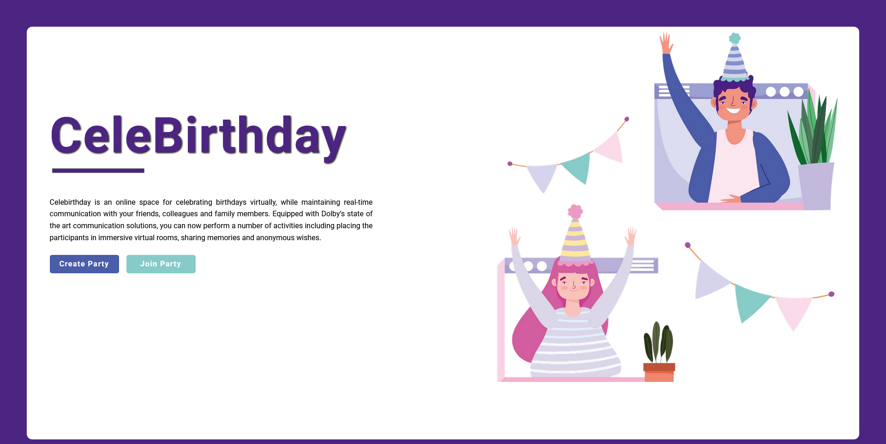

## Celebirthday

## Inspiration
Birthday celebrations, when executed well, are an opportunity to express love, to mark the life, share gifts, memories, blessings, and best wishes. However, with the pandemic, the virtual birthday celebrations have become relatively robotic and uninteresting. We felt a strong need for a birthday-themed meta-space that does not feel like just another online meeting, and can actually be impactful.

## What it does
 Celebirthday, provides a themed virtual space where you along with your friends can hang out, relive memories, share blessings, and do other fun activities to make the day memorable.
 about it. Secondly, we also learned about the importance and use of having pre-built SDKs. 

## What's next for Celebirthday
Celebirthday is still only a high fidelity MVP (minimum viable product), which has the potential to improve by adding in a ton of features.
We plan to achieve the following things in the future.
- Improve Overall User Interface of the Application
- Integrate Dolby's different audio/video filters and permissions in the conference. 
- Improve the overall security of the Application.
- Allow social login and calendar integrations

## Attributions
(Any missing attribution will be duly entertained and added)
- Most of the assets ( images, vectors and gifs have been taken from https://www.vecteezy.com/
- CSS cake animation from https://codepen.io/JensJ/pen/MzZrbw
